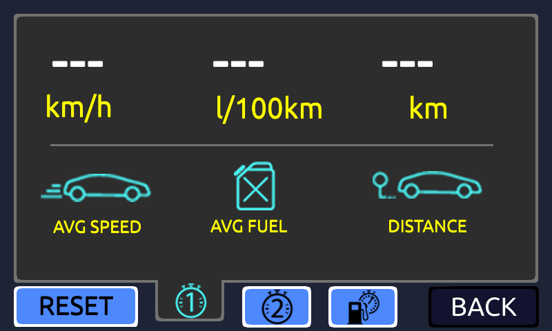
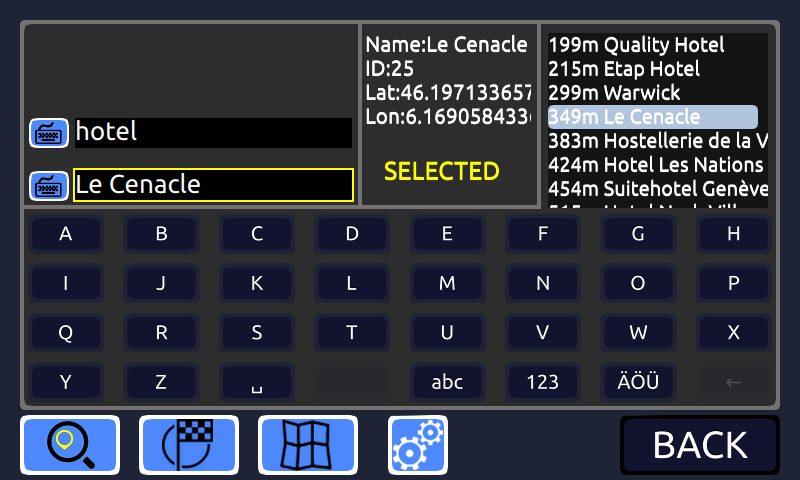
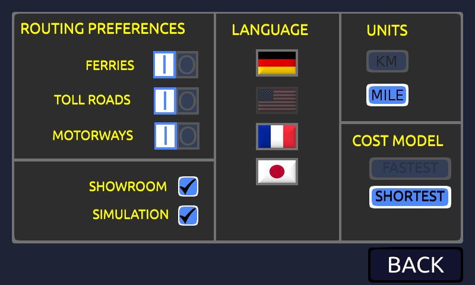
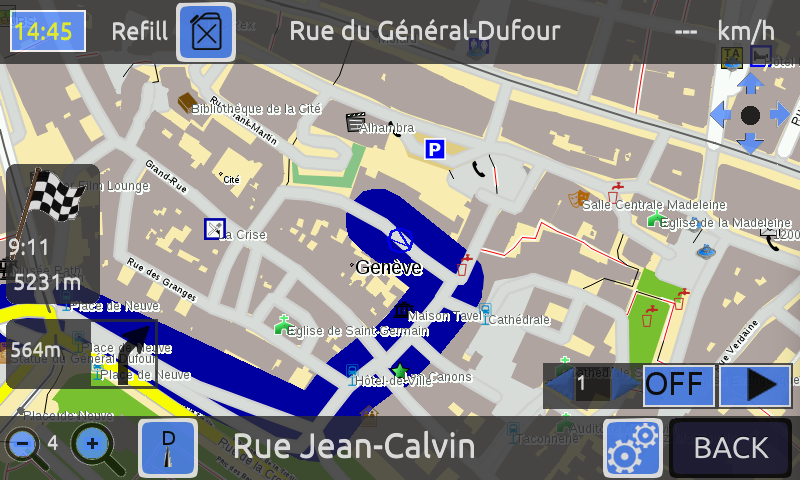

# Description of the menu tree structure

## Some naming conventions:

A menu is named with the corresponding qml file name.
Each menu contains a set of possible actions (e.g. push a button) that change the status and in some case open another menu
Actions are named with capital letters
 
## Available menus and details:

### NavigationAppMain
 
Rationale:
To allow to access sub menus
Actions: 
NAVI --> show navigation menu 
POI --> show poi menu
MAP --> show map viewer menu
TRIP --> show trip computer
QUIT --> close the application

###NavigationAppTripComputer
 
Rationale:
To display trip computer data, including tank disatnce and enhanced tank distance 
TRIP1 --> display trip 1
TRIP2 --> display trip 2
RESET --> reset the current displayed trip
BACK --> back to parent menu

###NavigationAppPOI      
 
Rationale:
To search for POIs, by selecting categories
To display it on the map
To launch a route calculation to reach a selected POI
Actions: 
KBCATE --> display categories
KBPOI --> button keyboard for poi
SEARCH --> button search
MAP --> button show on map
GOTO --> button goto the selected destination
KBYD --> keyboard area
BACK --> back to parent menu
 
###NavigationAppSettings
 
Rationale:
To configure the simulation 
To access sub menus for configuration
Actions:
SIMU --> on/off simulation
SPEED --> set simulation speed
MODE --> start/pause stop simulation
PREF --> access sub menu preferences
LANG&UNIT --> access sub menu language and units
BACK --> back to NavigationAppSearch
 
###NavigationAppSettingsLanguageAndUnits
 
Rationale:
To select language and units
Actions:
LANG --> select the language
UNIT --> select the unit
BACK --> back to NavigationAppSettings

###NavigationAppSettingsPreferences
 
Rationale:
To select preferences for route calculation
Actions:
COST --> select cost model
ROUTE_PREF --> select routing preference
BACK --> back to NavigationAppSettings

###NavigationAppSearch
 
Rationale:
To enter a location by a keyboard
To launch a route calculation
To launch a guidance and go to the map viewer menu
To display the route on the map 
To access sub menu poi
To access sub menu nav settings
Actions:
COUNTRY/CITY/STREET/NUMBER --> activate the keyboard and enter a destination
GOTO --> launch a route calculation
MAP --> display the route on map
ON --> launch a guidance and go to the map viewer menu
SETTINGS --> display the navigation settings menu
POI --> go to POI menu
BACK --> back to NavigationAppMain

###NavigationAppBrowseMap  
 
Rationale:
Actions:

 
Rationale:
To configure 2D/3D mode
Actions:
N/W/S/E --> change direction of the map view
2D/3D --> toggle between 2D and 3D map view
N/D --> toggle between night and day map view
TILTP/TILTM --> change tilt in 3D mode
HEIGHTP/HEIGHTM --> change height in 3D mode
DISTP/DISTM --> change distance of view in 3D mode
BACK --> hide the map view settings

 
Rationale:
To display the next maneuvers on the route ahead
Actions:
ROLL --> navigate into the list
BACK --> hide the list of maneuvers